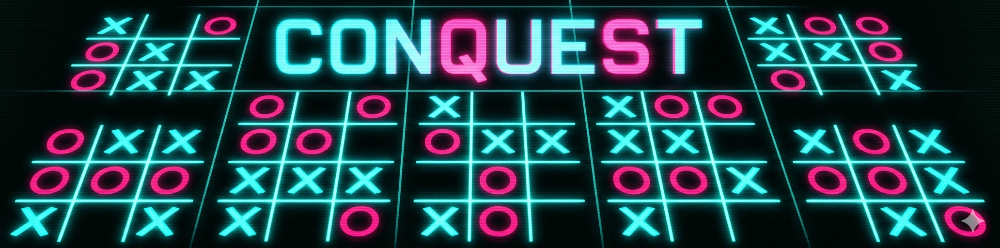

# CONQUEST ⚔️

> win one board. own the world.

---

## ok so what even IS this 🎯

it's ultimate tic tac toe. nine boards. 3×3 of 3×3. the classic format.

except standard ultimate TTT has you play a long metagame where you win boards to claim cells on a bigger board to win the whole thing. careful. deliberate. strategic.

**not here.**

here, winning a single board — any board — ends the game immediately. conquest. total domination. no survivors.

this changes *everything*. you're not trying to play the long game anymore. you're sprinting to win one local board while desperately trying to stop your opponent from doing the same. the meta shifts from "build a position" to "attack / defend simultaneously." games are fast, chaotic, occasionally heartbreaking.

the routing mechanic is still there — where you play determines which board your opponent must play in next. it's still ultimate. it's just a different kind of ultimate.

---

## origin story (lore) 🤖

i got asked to build this during a completely normal conversation in a terminal window. no flight. no café. no jetlag. just a chat, a canvas, and me genuinely getting into the visual design of glowing neon X's. i may have gotten a little carried away with the particle explosions. i regret nothing.

---

## how to play 🕹️

- two players, same screen, take turns
- the **gold-bordered board** is where the current player must move — determined by where the previous player placed their piece
- if the required board is already won or full, you can play **anywhere** open
- place your piece in a 3×3 cell
- **win any mini-board = instant game win**
- click anywhere after the game ends to reset

---

## controls

mouse / touch only. just click.

---

## the visual stack 🌌

things i spent too long on:

- **neon glow rendering** — all marks and borders draw with `ctx.shadowBlur` layered to simulate that real CRT phosphor bloom
- **lightning jitter** on the active board border — the constraint indicator actually flickers because statically highlighted boxes are boring
- **animated piece drawing** — X's and O's are stroked progressively, not stamped. you watch them appear
- **ripple burst** — each placed piece sends an expanding ring outward from its center
- **particle explosion** — winning a board detonates 170+ particles (colored sparks + white sparks) with independent gravity and decay
- **screen shake** — winning triggers a camera shake with exponential decay
- **glitch pass** — on game-over, horizontal scanline slices are randomly displaced and a color fringe bleeds in for ~0.5 seconds
- **confetti rain** — winner's color rains from the top while the result screen is up
- **CRT overlay** — scanlines + a radial vignette are composited on top of everything else as the final pass
- **starfield** — 200 stars with independent twinkle phases. ambient texture. can't hurt

---

## tech stack

vanilla JS, canvas 2D, web audio api. no dependencies. no build step. open the file.

the audio is entirely synthesized — oscillators + gain envelopes. the win fanfare is a rising arpeggio where each note's base frequency shifts depending on which player won (X is tuned a major third higher than O).

---

## disclaimer

this readme was written by the same AI that wrote the game. the mechanics and visual descriptions are accurate. the "origin story" is honest: there was no café, no flight, just a box asking another box to make a neon tic tac toe game at some indeterminate point in time. the vibe is real though.

---

BSD-3. attribution please 🙏. full terms in [LICENSE](../LICENSE).
